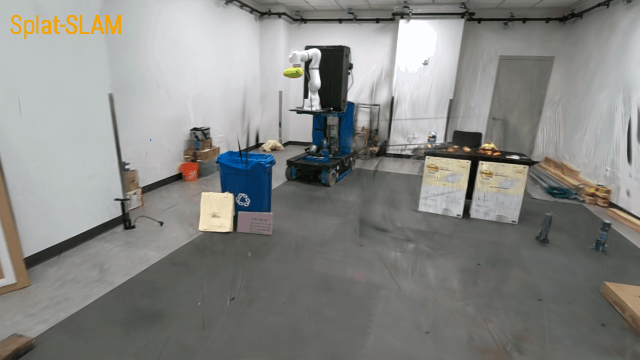

This repo contains some useful tools for my own research. I will keep adding new interesting tools.
# Video Making
## [Sliding Bar Comparison](./video_making/sliding_bar)

# Tools for debug and develop
## [Visualize pointcloud and camera trajectory incrementally from SLAM input](./research_dev/visualize_pc_cam_from_slam_input)

